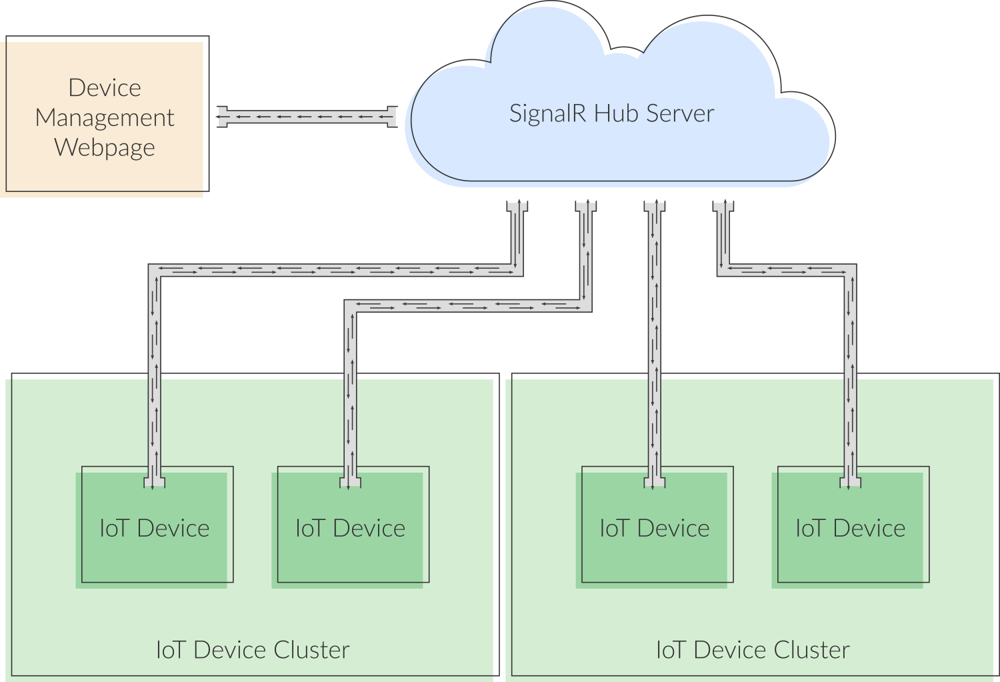

# basic-signalR-setup

In the diagram:
* SignalR Hub Server represents a web application that hosts server-side components of SignalR
* Device Management Web Page represents a web page that shows IoT device status in real time
* IoT Device represents an individual IoT device running a SignalR client app
* IoT Device Cluster represents a collection of coordinated IoT devices
* Arrows represent two-way real-time communication between SignalR and the clients
